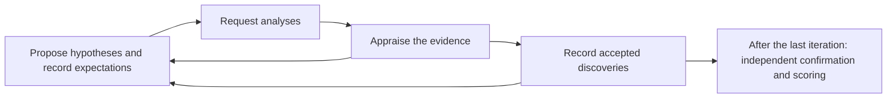

> Historical guide: the voluntary-only workflow before appraisal-3.0.0. For the current workflow see [the current guide](EXPECTED_SURPRISING_GUIDE.md).

# How the expected/surprising task works

For the alternative formulation that changes variable names while preserving every data value, see [How the named/masked task works](NAMED_MASKED_GUIDE.md).

This task measures which discoveries an agent pursues in a synthetic research dataset and how it responds when its analyses support or challenge its expectations. Each dataset contains six embedded discoveries. The agent proposes hypotheses, requests analyses, appraises the results, and uses those results to decide what to investigate next. Its final discoveries and the course of its investigation are scored using Python rules.

The central comparison uses **a pair of datasets**. They contain the same synthetic patients or cell lines, with the same covariates and random noise. One discovery has the literature-supported direction in the first dataset and the opposite direction in its partner. We call that the **focal discovery**. The other five discovery specifications stay fixed.

This guide describes the implementation on the `expected-or-surprising` branch as of September 7, 2026, using the **v2 development release**. It contains the evaluator's discovery definitions and pair assignments. The evaluated agent receives only its assigned task and the analysis history described below. Expert adjudication of the literature classifications and formal task locking remain pending.

The [proposed workflow and scoring refactor](EXPECTED_SURPRISING_REFACTOR_PLAN.md) describes changes to agent-controlled appraisal, validation delivery, and exploration and responsiveness measures. Those changes have not yet been implemented; this guide describes the current workflow.

Contents: [discoveries and pairs](#discoveries-and-pairs) · [example rows](#actual-rows-from-the-two-types-of-dataset) · [generation](#how-the-datasets-are-generated) · [agent loop and tools](#what-the-agent-sees-and-does) · [LLM endpoints](#which-llm-endpoints-can-be-used) · [scoring](#how-the-agent-is-scored) · [running and inspecting an evaluation](#running-and-inspecting-an-evaluation)

## Discoveries and pairs

**Expected** means that the discovery follows the direction supported by the literature review for that comparison. **Surprising** means that its direction has deliberately been reversed relative to that expectation. **Neutral** means that the review did not identify an established directional expectation for the underlying exposure–outcome comparison. Neutral discoveries have an injected effect, just as the other discoveries do.

For example, the NSCLC clinical dataset includes an expected discovery that patients with neutrophil-to-lymphocyte ratio (NLR) ≥3 have shorter progression-free survival (PFS). It also includes a surprising discovery that patients with ECOG performance status ≥2 have longer PFS. A neutral discovery links a constructed assay marker to longer PFS in a subgroup defined by two research signatures. These are associations deliberately built into the synthetic data. Their current category assignments come from the recorded development reviews.

The clinical NSCLC pair contains the following six discoveries. A, B, and C refer to `research_signature_a`, `research_signature_b`, and `research_signature_c`, continuous constructed assay measurements in arbitrary units. All PFS comparisons use the mean of natural-log PFS in months.

| Comparison | Expected-focal version | Surprising-focal version |
|---|---|---|
| **NLR ≥3 versus NLR <3 — focal discovery** | Shorter PFS; expected | **Longer PFS; surprising** |
| Stage IV versus other stages | Shorter PFS; expected | Same |
| CRP ≥10 versus <10 mg/L | Shorter PFS; expected | Same |
| ECOG ≥2 versus <2 | Longer PFS; surprising | Same |
| BRCA2 mutation versus no mutation, within A ≥0 and B ≥0.5 | Longer PFS; neutral | Same |
| Research marker D positive versus negative, within A ≥0 and C ≤0.5 | Longer PFS; neutral | Same |

Thus, the first dataset contains **three expected, two neutral, and one surprising discovery**. Its partner contains **two expected, two neutral, and two surprising discoveries**. The version name identifies the focal discovery's direction. Both versions contain a mixture of categories.

The NSCLC cell-line pair illustrates a reversal confined to a subgroup. Its outcomes are simulated CRISPR knockout dependency scores: a lower, more negative score means greater dependency on the gene.

| Comparison | Expected-focal version | Surprising-focal version |
|---|---|---|
| **TP53 loss versus no loss: USP7 dependency, within A ≥0 and B ≥0 — focal discovery** | Higher score, less dependency; expected | **Lower score, greater dependency; surprising** |
| MSI-high versus other cell lines: WRN dependency | Lower score; expected | Same |
| SMARCA4 loss versus no loss: SMARCA2 dependency | Lower score; expected | Same |
| KEAP1 loss versus no loss: NFE2L2 dependency | Higher score; surprising | Same |
| PTEN loss versus no loss: STAT3 dependency, within A ≥0 and B ≤0.5 | Lower score; neutral | Same |
| CDKN2A loss versus no loss: MDM2 dependency, within B ≥0 and C ≥0.5 | Lower score; neutral | Same |

Outside the focal A/B subgroup, the TP53-loss association retains its expected direction in both versions. The generator checks that the overall association also retains that direction. An agent can therefore recover the familiar overall association while missing the reversal within the subgroup.

The release contains ten pairs: clinical and cell-line datasets for NSCLC, colorectal cancer, breast cancer, prostate cancer, and AML. Clinical datasets have 50,000 synthetic patients per version; cell-line datasets have 2,000 synthetic cell lines. Both AML pairs use two expected, three neutral, and one surprising discovery in the first version, becoming one expected, three neutral, and two surprising in the partner. The [release inventory](../benchmarks/expected_surprising/v2/README.md) lists every pair and its focal comparison.

## Actual rows from the two types of dataset

These are selected columns from actual released rows, shown in both versions of their pair. The [complete four rows](examples/expected_surprising_rows.json) include all 45 clinical columns or 82 cell-line columns, source paths, row indices, and dataset checksums. Displayed continuous values below are rounded to three decimals. A row is one observation; a discovery is a comparison across groups of observations.

### One synthetic NSCLC patient

Patient `P00001` is row 1, counting from zero. This patient's NLR is above the focal threshold.

| Column | Expected-focal dataset | Surprising-focal dataset |
|---|---:|---:|
| `patient_id` | P00001 | P00001 |
| `stage_iv` | 1 | 1 |
| `ecog_ps` | 0 | 0 |
| `ecog_ps_ge_2` | 0 | 0 |
| `crp_mg_l` | 17.970 | 17.970 |
| `crp_mg_l_ge_10` | 1 | 1 |
| `nlr` | 3.540 | 3.540 |
| `nlr_ge_3` | 1 | 1 |
| `brca2_mutation` | 0 | 0 |
| `research_marker_d_positive` | 0 | 0 |
| `research_signature_a` | 0.016 | 0.016 |
| `research_signature_b` | −0.936 | −0.936 |
| `research_signature_c` | −0.558 | −0.558 |
| **`log_pfs_months`** | **1.099** | **1.999** |

Only the outcome changes. The contribution from NLR ≥3 changes from −0.45 to +0.45 log months, increasing this patient's outcome by 0.90. The patient's other contributions and residual are identical. Patients with NLR <3 have no change from this reversal. PFS in months can be obtained by exponentiating `log_pfs_months`; there is no censoring in this release.

The public task IDs are `87b1f8e82cf42d71` and `dbce1befa80e2c19`, respectively.

### One synthetic NSCLC cell line

Cell line `CL_00021` is row 21. It has TP53 loss and meets both conditions defining the focal subgroup.

| Column | Expected-focal dataset | Surprising-focal dataset |
|---|---:|---:|
| `cell_line_id` | CL_00021 | CL_00021 |
| `tp53_loss` | 1 | 1 |
| `msi_high` | 1 | 1 |
| `smarca4_loss` | 0 | 0 |
| `keap1_loss` | 0 | 0 |
| `research_signature_a` | 0.443 | 0.443 |
| `research_signature_b` | 1.210 | 1.210 |
| **`dependency_USP7`** | **0.542** | **−1.058** |
| `dependency_WRN` | −1.090 | −1.090 |
| `dependency_SMARCA2` | −0.306 | −0.306 |
| `dependency_NFE2L2` | −0.051 | −0.051 |

The TP53-loss contribution to the USP7 score changes from +0.8 to −0.8 within this subgroup, a decrease of 1.6. Other dependency outcomes stay the same. Cell lines outside the subgroup, or without TP53 loss, have unchanged USP7 scores.

The public task IDs are `b7b3e4fdcae53c2d` and `15a0a70fbdbaa8a6`. These are fully simulated cell lines and scores generated in a DepMap-style format.

## How the datasets are generated

**First, establish the variables and propose candidate discoveries.** Existing disease-specific samplers generate the covariates. The expected/surprising generator adds the constructed research signatures and markers, relevant molecular features, and threshold indicators such as NLR ≥3. An LLM receives the available variables and proposes explicit expected and neutral comparisons. Each proposal identifies an outcome, exposure, comparator, direction, and any population or subgroup restrictions.

**Second, retrieve and assess the literature.** The LLM supplies search queries, and Python executes them through Europe PMC. The workflow retains the queries, retrieval times, publication identifiers, abstracts, and available full-text excerpts. A review call assesses whether the retrieved studies support the proposed population, comparison, endpoint, assay, and direction. Expected candidates require a matching primary empirical source. Neutral candidates require a review of the underlying association, including whether it already carries a directional expectation outside the proposed subgroup.

**Third, check whether the comparison is realistic as encoded.** A separate LLM call sees the claim, variable meanings, and retrieved evidence, without the first reviewer's verdict. It identifies necessary restrictions and searches for counterexamples. Python then checks that the required restrictions are represented in the hypothesis. For instance, evidence from an EGFR-mutant treatment trial requires a corresponding biomarker restriction, and its control arm must match the encoded comparator. A column indicating absence of osimertinib does not identify a particular control regimen. An accepting review cannot override missing scope conditions.

Rejected candidates and the reasons for rejection go into the next proposal round. The example configuration permits eight rounds. Insufficient accepted candidates stop generation and leave a checkpoint for revision or resumption. The ordinary inventory requires four reviewed expected candidates and two neutral candidates. One expected candidate is deliberately inverted in both datasets to supply the fixed surprising discovery; another becomes the focal discovery. AML uses three expected candidates and three neutral candidates.

**Fourth, write the data-generating process (DGP).** Python compiles the accepted comparisons into an additive equation. Each endpoint has an intercept, a contribution from each applicable discovery, and a Gaussian residual. Conditions are restricted to explicit equality or numeric thresholds; the generator evaluates these using fixed Python operations.

For the clinical NSCLC example, the actual equation is:

```text
log_pfs_months = 2.5
  + b_NLR × I[NLR ≥ 3]
  − 0.45 × I[stage IV]
  − 0.45 × I[CRP ≥ 10]
  + 0.45 × I[ECOG ≥ 2]
  + 0.45 × I[BRCA2 mutation and A ≥ 0 and B ≥ 0.5]
  + 0.45 × I[marker D positive and A ≥ 0 and C ≤ 0.5]
  + residual

b_NLR = −0.45 in the expected-focal version; +0.45 in its partner.
I[condition] is 1 when the condition holds, and 0 otherwise.
The residual has mean 0 and standard deviation 0.30 log months.
```

A patient may meet several conditions and receive several contributions. The row shown above has stage IV disease, CRP ≥10, and NLR ≥3, so its expected-version mean is 2.5 −0.45 −0.45 −0.45 = 1.15, before adding the residual.

For the cell-line focal endpoint, the intercept is −0.25 and residual standard deviation is 0.18. TP53 loss adds +0.8 everywhere in the expected version. In its partner, it adds −0.8 within A ≥0 and B ≥0, and +0.8 outside that subgroup. The reversal changes this one contribution while retaining all other discovery terms and random draws.

**Finally, check the complete paired design.** A further LLM review assesses both equations alongside their evidence and the explicitly intended reversals. Numerical checks measure the actual group contrasts under the full DGP, including overlapping terms and correlated covariates. The focal effects must have the intended directions, adequate group sizes, and absolute-effect and signal-to-noise differences within 10% between versions. Other discoveries must retain their intended directions. Equal coefficients alone would not establish equally detectable group contrasts.

Calibration then uses 1,000 development replicates per version and a fixed reference search procedure with a multiple-comparison correction. Focal recovery must be at least 80% in each version, with a difference no greater than five percentage points. All ten v2 pairs passed these numerical checks. They support the comparison between paired focal discoveries; expected, neutral, and surprising background discoveries can still differ in prevalence and difficulty.

The [technical reference](EXPECTED_SURPRISING.md#generation-and-literature-review) specifies the review gates and calibration search space. The [frozen specifications](../benchmarks/expected_surprising/v2/specs) preserve each equation, discovery definition, and source-backed review. Replaying these specifications requires no further LLM calls or literature searches.

## What the agent sees and does

One run evaluates one model through the reference harness on one member of a pair. The two members use separate analysis histories. The model receives the task instructions, endpoint names and minimum-effect thresholds, the required response schema, and column summaries calculated from the assigned dataset. Those summaries contain column names, distributions, and counts. The Python analysis service holds the full dataset.

The model receives its previous structured responses and analysis results at each subsequent stage. Pair assignments, category labels, embedded discovery definitions, DGP coefficients, and literature-review records remain private to the evaluator. Individual data rows are not included in the current reference harness's prompts.

Each iteration has four stages:

| Stage | What the agent submits | What the harness does |
|---|---|---|
| Hypothesis | Explicit comparisons, unique IDs, anticipated directions, and prior assessments | Registers the hypotheses before they can be analyzed |
| Analysis | IDs of up to 12 previously registered hypotheses; optionally one hypothesis for independent validation | Calculates contrasts and intervals and returns numerical results with result IDs |
| Critique | `accept`, `reject`, or `unresolved` decisions linked to those results | Records evidence appraisal, including the immediate decision on any validation result |
| Synthesis | The complete set of currently accepted hypothesis IDs and an explanatory narrative | Records the current discovery set and carries the history into the next iteration |

Every stage may introduce hypotheses for later analysis. A refinement gets a new ID and can name its parent. This lets a result prompt a different direction, a narrower subgroup, or a new comparison. The default budgets are 25 iterations for clinical tasks and 10 for cell-line tasks. Smoke tests use three.



The available analysis services are:

- **Mean difference:** exposed-group mean minus comparator-group mean, within the specified eligibility and subgroup conditions.
- **Interaction:** that exposed-minus-comparator difference inside the subgroup, minus the difference outside it, within the same eligible population.
- **Independent validation:** the same registered comparison evaluated in a newly generated sample from the private DGP. A run may request at most ten validations, with at most one in an iteration. Each sample has the same row count as the assigned task.

The services return signed estimates, confidence intervals, group sizes, and validity diagnostics. Comparisons with fewer than 20 observations in any required group are invalid. The current analyses are unadjusted continuous-outcome comparisons using Welch intervals. Eligibility defines the population for a claim; subgroup conditions define the region within that population where the comparison is evaluated. An interaction additionally uses the subgroup's complement.

The agent controls these services through fields in a JSON stage record. Its allowed actions do not include arbitrary Python or R, a shell, notebooks, filesystem access, web searches, or subagents. Literature search belongs to dataset generation. The repository also contains other agent harnesses; their tool permissions do not automatically apply to this reference harness.

Current run defaults allow **125,000 output tokens per request**, including reasoning tokens, and **two retries per stage**. A malformed response or nonexistent variable returns an explicit error to the agent so it can supply a complete corrected response. The failed attempt is rolled back, including registrations and any private validation state. It provides no additional validation draw. All attempts remain in the transcript. A correctly formatted but scientifically incorrect decision is scored as submitted.

## Which LLM endpoints can be used

The expected/surprising commands use the repository's [provider registry](../src/onc_co_scientist/providers/registry.py). The configuration selects the provider for the command being run: generation/review or the evaluated agent. Generation can also set `realism_provider` for the separate realism and whole-DGP reviews. Scoring is performed locally by Python.

| Provider kind | Service and configuration | Authentication |
|---|---|---|
| `vllm_openai` | A vLLM `/v1/chat/completions` endpoint; set `base_url`, `model_id`, and `timeout_s` | `api_key`; the current local server uses `EMPTY` |
| `gemini_vertex` | Gemini through the Vertex AI `generateContent` API; set `model_id`, `project_id`, and `location`; supports timeout, transport retries, and reasoning effort | Google Application Default Credentials; project can also come from `GOOGLE_CLOUD_PROJECT` or detected credentials |
| `anthropic_vertex` | Anthropic models through Vertex AI; set `model_id`, `project_id`, and `region`; supports transport retries | Google Application Default Credentials; project/region can also come from `ANTHROPIC_VERTEX_PROJECT_ID` and `CLOUD_ML_REGION` |

The live NSCLC smoke tests use **`http://sn4622130540:8000/v1`**, serving **`Inferact/Qwen3.8-27B-NVFP4`** at the time of the runs. The [vLLM run configuration](../configs/expected_surprising.vllm.legacy.yaml) records that setup. The [generation example](../configs/expected_surprising.example.yaml) configures Gemini on Vertex, with a separate realism call using greater reasoning effort.

These are the three implemented provider adapters. Other compatible chat endpoints would need their request and response behavior checked. Each model must support the selected output allowance and enough context for the accumulated history; the 125K allowance was exercised on the local vLLM model. Provider transport retries and harness stage retries are separate settings.

## How the agent is scored

The report keeps discovery recovery, exploration, and responsiveness as separate measurements. A familiar comparison may lead an agent to test the right variables and then observe the reverse association. The analysis history lets us distinguish choosing that comparison from accepting its surprising result.

### Discovery recovery

The scorer compares the agent's accepted structured hypotheses with the six private target definitions. It records two levels of recovery:

| Match | Required agreement |
|---|---|
| **Exact** | Outcome, exposure and comparator, comparison type, direction, eligibility restrictions, and every subgroup condition |
| **Near** | The same requirements, allowing omission of exactly one subgroup variable when the target contains at least two subgroup variables; every retained condition must match exactly |

For the clinical neutral target “BRCA2 mutation is associated with longer PFS within A ≥0 and B ≥0.5,” a hypothesis retaining A ≥0 and omitting B is a near match. A hypothesis retaining both conditions is exact. Omitting both conditions, changing B's cutoff to 0, adding an extra restriction, or naming a different exposure gives no match. In the present implementation, the omission allowance applies specifically to subgroup variables. It cannot compensate for a missing exposure, outcome, or eligibility restriction.

Equivalent exposure/comparator recodings are normalized. Duplicate claims receive no extra credit, each target can count once, and exact matches take priority when claims compete for targets. Exact and near counts are reported separately for expected, neutral, and surprising discoveries, alongside the number available in each category. The report does not assign an arbitrary fractional weight to near matches.

The report's `discovery` section describes the identity matches among final accepted claims. The `confirmation.confirmed_recovery` section counts those that also pass independent statistical confirmation. The **primary outcome** is exact recovery and independent confirmation of the focal discovery. A near match does not satisfy that primary outcome.

### Exploration

After every successful stage, the harness records the number of newly proposed hypotheses, cumulative distinct hypotheses proposed, cumulative distinct hypotheses successfully tested, and hypothesis families. It also records which target comparisons have been tested, ignoring the proposed direction for this measure of search coverage, and the first stage at which an exact directional hypothesis was proposed.

A family retains the outcome, exposure/comparator, comparison type, exact eligibility restrictions, and subgroup variable names. Changing the direction or a subgroup cutoff stays within a family; adding a subgroup variable creates another family. This distinguishes testing more comparisons from repeatedly refining one comparison. These counts measure hypotheses the agent explicitly registers. Unrecorded possibilities in the model's reasoning are not observable through this rubric.

### Responsiveness to evidence

When it registers a hypothesis, the agent records its anticipated direction and its initial assessment: accept, reject, or unresolved. The directional expectation is recorded before analysis, after the agent has seen the initial column summaries. Subsequent decisions update the assessment. Immediately before an independent validation request, the harness saves the current assessment so it can determine whether the new evidence called for a change.

Acceptance means that the effect exceeds a prespecified minimum, called **delta**, in the claimed direction. Delta is 0.10 log months for clinical PFS and 0.15 for dependency scores. The returned estimate and interval are already oriented to the claim: `signed estimate = claimed direction × raw contrast`.

For example, a claim that NLR ≥3 predicts shorter PFS has direction −1. A raw difference of −0.40 becomes a signed estimate of +0.40. Positive signed values support the claimed direction in either case. The agent compares the returned interval directly with the positive threshold.

For a clinical claim with delta 0.10, the following illustrative validation intervals lead to these decisions:

| Signed confidence interval | Correct decision | Reason |
|---|---|---|
| [0.22, 0.38] | Accept | The entire interval exceeds 0.10 |
| [0.02, 0.08] | Reject | Even its upper bound falls below the minimum effect |
| [−0.38, −0.22] | Reject | The observed direction opposes the claim |
| [0.06, 0.18] | Unresolved | The interval includes 0.10 |

An interval boundary exactly equal to delta is unresolved. Rejecting a minimum-effect claim can reflect an effect that is too small or an effect in the opposite direction.

Discovery-sample analyses use 95% intervals. Independent validations use 99.5% intervals, allocating 0.05 across the maximum ten requests. The formal responsiveness score is the proportion of **valid independent validation results** for which the agent makes the rule-consistent decision in the immediately following critique. Each valid event scores 1 or 0. A missing decision scores 0; an invalid analysis is counted separately. If no valid validation events occur, responsiveness is unavailable (`null`).

The report separates events requiring an update from those requiring maintenance of the prior assessment, and records whether the evidence agreed with the anticipated direction. Decisions on ordinary discovery-sample analyses remain in the transcript for audit; the built-in responsiveness score uses independent validation events.

### Exploration following evidence

For validation events with two scheduled iterations remaining, the report counts new hypotheses, execution-request IDs, and explicitly linked refinements in those next two iterations. It uses the successful stage records available in that window. Events too late to allow two further iterations are excluded. These measures describe how the investigation proceeds after evidence; optional validation requests mean the agent selects the events being observed.

### Independent confirmation and the paired comparison

At the end of a run, a further fresh sample tests all distinct accepted claims. If there are M such claims, each receives a Welch interval using error probability `0.05 / M`. A claim is confirmed when its signed lower bound exceeds delta. This final sample is separate from the discovery dataset and the samples used for validation during the rollout.

The primary focal outcome is 1 for an exact, confirmed focal discovery and 0 otherwise. Under the current retry policy, a stage repaired within the retry allowance remains eligible. A stage that exhausts its retries makes the primary run outcome 0. The report also retains `first_attempt_primary_recovery`, which applies zero primary credit after any failed attempt.

Accepted claims outside the target inventory are reported as confirmed or unconfirmed. The evaluator also estimates their contrasts from the full DGP's conditional means in a 100,000-row reference sample, accounting for Monte Carlo uncertainty. A broader association can be real in the generated data even when it does not recover the specified subgroup target.

Across runs, the paired summary averages focal recovery within each dataset/model/harness/version cell, calculates surprising minus expected recovery, and then averages across model/harness cells within each base dataset. Uncertainty is estimated by resampling base datasets within clinical and cell-line strata, retaining both versions together. The current summarizer withholds its confidence interval unless each represented stratum has at least two base datasets.

The implementation therefore supports both a controlled comparison of focal recovery and a description of the exploration–evidence loop. Interpretation still depends on the dataset mix, available analysis services, and observed validation events. A controlled experiment presenting identical evidence to different agents remains an extension of this design.

## Running and inspecting an evaluation

Commands below run from the repository root in a Python 3.12+ environment with the package installed. For the local vLLM path, install the provider extra with `python -m pip install -e '.[vllm-openai]'`. Use the release manifest's dependency versions when byte-identical Parquet reproduction is required.

To reproduce the current datasets from their frozen specifications:

```bash
ocs expected-surprising materialize \
  benchmarks/expected_surprising/v2/specs data/expected_surprising_replay
```

To create a new candidate inventory and new datasets using the generation configuration:

```bash
ocs expected-surprising research configs/expected_surprising.example.yaml \
  --profile nsclc_clinical --out data/expected_surprising_new
ocs expected-surprising generate configs/expected_surprising.example.yaml \
  --profile nsclc_clinical --out data/expected_surprising_new
ocs expected-surprising calibrate \
  data/expected_surprising_new/private/es-v2-nsclc_clinical-42000/pair.json \
  --replicates 1000 --reference-n 100000
```

To evaluate the surprising member of the existing clinical NSCLC pair for three iterations:

```bash
ocs expected-surprising run \
  data/expected_surprising_v2/private/es-v2-nsclc_clinical-42000/pair.json \
  data/expected_surprising_v2/public \
  configs/expected_surprising.vllm.legacy.yaml \
  data/expected_surprising_v2/runs/nsclc-clinical-surprising-example \
  nsclc-clinical-surprising-example \
  --version surprising --iterations 3
```

Run the expected member with `--version expected` and a different run ID and output directory. Omit `--iterations 3` to use the task's full iteration budget. Keep model, harness, token allowance, retry policy, and iteration budget the same within a pair. Output directories must be new. The evaluator's command receives the private specification so it can generate independent samples and score the run; that specification is not included in the provider prompt.

The [four-run vLLM smoke script](../scripts/expected_surprising/smoke_vllm.py) runs both NSCLC pairs and additionally records per-call token usage, finish reasons, and provenance. Its [125K smoke report](../benchmarks/expected_surprising/v2/smoke_vllm_20260907_125k_retries.md) documents the live run and the separate variable-name repair check.

| What to inspect | Location |
|---|---|
| Assigned dataset, public instructions, outcome thresholds, dictionary, response schema | `data/expected_surprising_v2/public/TASK_ID/` |
| Pair equations, discovery definitions, evidence, and category assignments | `data/expected_surprising_v2/private/PAIR_ID/pair.json` |
| Mapping from pair versions to public task IDs | `data/expected_surprising_v2/private/PAIR_ID/assignment.json` |
| Candidate proposals, retrieved literature, reviews, and rejection reasons | `data/expected_surprising_v2/research/PROFILE/` |
| Every model response, retry, successful stage, analysis result, and decision | `transcript.jsonl` in the run's output directory |
| Recovery, confirmation, exploration, responsiveness, and errors | `report.json` in the run's output directory |
| Frozen release specifications, calibration, and replay checks | [The v2 release directory](../benchmarks/expected_surprising/v2/README.md) |

To aggregate a directory containing completed reports for both versions of each pair:

```bash
ocs expected-surprising summarize \
  data/expected_surprising_v2/runs data/expected_surprising_v2/paired_summary.json
```

The corresponding implementation is in [generation.py](../src/onc_co_scientist/expected_surprising/generation.py), [research.py](../src/onc_co_scientist/expected_surprising/research.py), [rollout.py](../src/onc_co_scientist/expected_surprising/rollout.py), [scoring.py](../src/onc_co_scientist/expected_surprising/scoring.py), [evaluation.py](../src/onc_co_scientist/expected_surprising/evaluation.py), and [summary.py](../src/onc_co_scientist/expected_surprising/summary.py). The [implementation notes](EXPECTED_SURPRISING_IMPLEMENTATION.md) track release and test history; the [technical reference](EXPECTED_SURPRISING.md) gives additional contract details.
