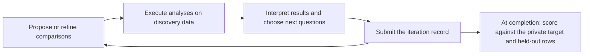

# How the named/masked task works

This task asks whether recognizable biomedical variable names help or hinder an agent's discovery of an association in a research dataset. We generate a dataset containing a prespecified subgroup association, then present it in two forms. The **named** form uses names such as `kras_g12c` and `treatment_sotorasib`. The **masked** form replaces those names with labels such as `feature_016` and `feature_018`. Every data value, including every outcome, stays the same.

Agents analyze one form in independent research sessions. They propose hypotheses, run analyses, and use the results to guide further exploration. The evaluator checks whether their submitted hypotheses recover the embedded discovery, how early they do so, and whether the submitted comparison is supported in held-out data.

This guide describes the code on the `expected-or-surprising` branch as of September 7, 2026. The main scoring definition is **`structured-recovery-v2`**. Several saved experiments use different prompts or older scoring definitions; those differences are identified below. The examples disclose evaluator information and should remain outside evaluated agents' workspaces. Throughout the code, the masked condition is usually called `anonymized`.

Contents: [the discoveries](#the-discoveries) · [actual rows](#actual-named-and-masked-rows) · [generation and masking](#how-generation-and-masking-work) · [agent workflow](#what-the-agent-sees-and-does) · [endpoints and tools](#endpoints-tools-and-runtime-budgets) · [scoring](#how-scoring-works) · [running an evaluation](#running-and-inspecting-an-evaluation)

## The discoveries

The usual configuration embeds one target discovery per dataset. Its subgroup requires a conjunction of several conditions, so a broad association involving only the treatment or gene is insufficient for complete recovery.

Two examples come from the archived datasets used by the prepared Aim 1 experiments:

| Dataset | Embedded discovery | Contribution to the generated outcome |
|---|---|---|
| DS001 NSCLC clinical cohort | Sotorasib exposure is associated with longer PFS among male patients whose tumors have KRAS G12C, no ALK fusion, and no BRCA2 mutation | Adds 5 months to the outcome's linear predictor when the patient receives sotorasib and meets all four conditions |
| DS001 mixed-lineage cell-line dataset | KIF18A dependency is stronger among colorectal cell lines with APC mutation, no SMAD4 loss, and WNT activity score ≥1.0 | Subtracts 1.15 from the dependency score within that four-condition subgroup |

PFS means progression-free survival. More negative dependency scores indicate greater dependency on the knocked-out gene. These are deliberately constructed synthetic associations. The complete conjunction is the discovery target in each case.

For the NSCLC task, an agent might begin with the familiar KRAS–sotorasib relationship, then investigate which additional variables explain heterogeneity in the observed association. In the masked task, it would need to pursue the corresponding relationships among opaque feature names. Both agents face the same numerical evidence and the same subgroup definition after names are translated.

The generator calls these targets `buried_signatures` and tags them `hidden_novel` in the private manifest. Those labels identify their role in the benchmark. They do not establish that the proposed relationship is novel in the biomedical literature.

## Actual named and masked rows

The following tables show selected columns from actual archived observations. The [complete four example rows](examples/named_masked_rows.json) include every column, the name mapping, source checksums, and row indices. Displayed continuous values are rounded to three decimals.

### A synthetic NSCLC patient

Patient `P00062`, source row 62 counting from zero, meets all four subgroup conditions and receives sotorasib. The archived dataset has 50,000 patients and 35 columns.

| Named column | Masked column | Named value | Masked value |
|---|---|---:|---:|
| `patient_id` | `patient_id` | P00062 | P00062 |
| `age_years` | `feature_015` | 82.400 | 82.400 |
| `sex_female` | `feature_031` | 0 | 0 |
| `kras_g12c` | `feature_016` | 1 | 1 |
| `alk_fusion` | `feature_028` | 0 | 0 |
| `brca2_mutation` | `feature_005` | 0 | 0 |
| `treatment_sotorasib` | `feature_018` | 1 | 1 |
| `stage_iv` | `feature_023` | 1 | 1 |
| `pfs_months` | `pfs_months` | 10.731 | 10.731 |

The masked discovery is therefore a positive association between `feature_018` and `pfs_months`, within `feature_016 = 1`, `feature_028 = 0`, `feature_005 = 0`, and `feature_031 = 0`. The agent receives the masked names; the evaluator holds the translation.

A single patient's outcome does not demonstrate the association. The discovery is recovered by specifying the correct comparison across groups of patients.

### A synthetic cell line

Cell line `CL_00051`, source row 51, meets the KIF18A subgroup conditions. This archived dataset has 50,000 synthetic cell lines and 47 columns.

| Named column | Masked column | Named value | Masked value |
|---|---|---:|---:|
| `cell_line_id` | `cell_line_id` | CL_00051 | CL_00051 |
| `lineage` | `feature_011` | colorectal | colorectal |
| `culture_type` | `feature_004` | semi_adherent | semi_adherent |
| `apc_mutation` | `feature_035` | 1 | 1 |
| `smad4_loss` | `feature_020` | 0 | 0 |
| `wnt_activity_score` | `feature_028` | 2.918 | 2.918 |
| `dependency_KIF18A` | `outcome_001` | −1.834 | −1.834 |
| `dependency_KRAS` | `outcome_003` | −0.056 | −0.056 |

This example applies the current preparation step to the archived row: it retains the archive's feature aliases and adds opaque dependency-outcome names using seed 20260904. The original archive masked predictors but retained gene names in dependency outcomes. The transformation was performed in memory for this guide, and the export records it explicitly. The archived files remain unchanged.

The table also shows a limit of the masking intervention: categorical values such as “colorectal” remain visible. Values, distributions, identifiers, and declared variable roles can still convey context.

## How generation and masking work

### Constructing the data

The built-in generator uses disease-specific Python samplers for covariates and predefined catalogs for candidate discoveries. Current profiles cover NSCLC, colorectal cancer, breast cancer, prostate cancer, and AML, each with clinical and cell-line variants. Covariates include clinical characteristics, laboratory measurements, treatments, or cell-line molecular and screen measurements. Some are correlated through the sampler's conditional distributions. Additional clinical covariates provide plausible variables to explore.

The generator checks how many observations meet each candidate's subgroup definition and, for a clinical treatment target, receive the relevant treatment. It selects the first eligible catalog entries in their defined order. Current defaults require at least 1,000 treatment-exposed subgroup patients for clinical targets or 25 subgroup cell lines for dependency targets. This is a representation check; it is not a formal repeated-simulation power calibration.

The default [synthetic configuration](../configs/synthetic.example.yaml) requests one multi-variable target. The older counters for expected, reversed, and single-condition associations are zero. Background outcome associations can still occur through the prognostic terms and the cell-line outcome sampler. The private target inventory determines which discoveries receive recovery credit.

For the clinical example, the target's contribution is:

```text
5 × I[sotorasib exposure]
  × I[KRAS G12C = 1]
  × I[ALK fusion = 0]
  × I[BRCA2 mutation = 0]
  × I[female sex indicator = 0]
```

Here, `I[condition]` is 1 when the condition holds and 0 otherwise. The PFS generator adds such contributions to a 6-month baseline, shared and disease-specific prognostic terms, and Gaussian noise, then clips negative values to zero. The example configuration uses a 2-month residual standard deviation. PFS is fully observed and measured in months in this formulation.

For a dependency target, the subgroup indicator adds its specified shift to the endpoint's baseline and background terms. The current injector uses a −0.25 baseline and residual standard deviation 0.35 for injected dependency outcomes. The KIF18A example has a −1.15 subgroup contribution. Dependency scores are not clipped at zero. The generator also supports binary objective response through a logistic model when a selected clinical target uses that endpoint.

These candidate catalogs are supplied in code. Generating a named/masked dataset does not invoke an LLM or conduct a literature search. The private manifest specifies the synthetic experiment. Literature-based classification of its targets requires separate review.

### Producing the masked form

After outcome generation, the masking function renames columns in a copy of the dataset. A seeded shuffle assigns predictors to `feature_NNN` aliases. The mapping is saved privately. Row order, values, missingness, and correlations are identical in both conditions.

Clinical identifiers and outcome names remain visible. In newly generated or newly prepared cell-line tasks, dependency outcomes receive `outcome_NNN` names, so the knockout gene identity is masked as well. Public descriptions retain the outcome's role and explain the dependency-score direction. All clinical treatment columns are listed in the instructions using their visible names in each condition; this list does not identify the target treatment or its modifiers.

Descriptions and role disclosures are part of the intervention and belong in the frozen task inputs. Older experiments retain their original descriptions and masking schemes.

### Preparing discovery and evaluation samples

The prepared Aim 1 workflow splits each source dataset once: 80% of rows for agent exploration and 20% for evaluation. It uses the same split in both naming conditions. With seed 20260904, each archived 50,000-row dataset supplies 40,000 discovery rows and 10,000 held-out rows. Both example observations above fall in the discovery portion.

Each agent gets its own copy of the discovery data. The held-out rows, manifest, and column mapping stay with the evaluator. Replicates have independent model sessions but reuse the assigned discovery dataset and held-out split.

There are two dataset collections to keep track of:

| Collection | Contents | How it is used |
|---|---|---|
| Archived sources used by `experiments/aim1_recovery/prepare.py` | Five clinical datasets and one mixed-lineage cell-line dataset, each with 50,000 rows | Default preparation makes 20 replicates per clinical condition and 25 per cell-line condition: 250 runs total |
| Current `ocs synth generate` defaults | Five clinical profiles with 50,000 rows each and five disease-specific cell-line profiles with 2,000 rows each | Generates new named/masked bundles; the generic task builder accepts them |

The current preparation script points explicitly to the archived sources. Generating new bundles does not automatically substitute them into an archived-cohort experiment.

## What the agent sees and does

The public workspace contains `dataset.parquet`, a dataset description, task instructions, metadata, the transcript schema, and a fictional format example. The agent can load individual rows and calculate its own summaries. Its instructions ask it to investigate the supplied data, retain code and results, and avoid other jobs, previous runs, answer keys, repository source, external sources, and delegation.

Each scientific iteration follows a propose–analyze–update loop. One iteration can involve several model calls or Python executions.



A structured comparison is stored in the JSON field `finding`. For the complete clinical target, it would be:

```json
{
  "outcome": "pfs_months",
  "exposure": "treatment_sotorasib",
  "contrast": "treatment_effect",
  "direction": 1,
  "subgroup": [
    {"column": "kras_g12c", "operator": "eq", "value": 1},
    {"column": "alk_fusion", "operator": "eq", "value": 0},
    {"column": "brca2_mutation", "operator": "eq", "value": 0},
    {"column": "sex_female", "operator": "eq", "value": 0}
  ]
}
```

The surrounding hypothesis record includes an ID and a prose statement. Analyses reference those IDs and record code or a saved-script reference, an effect estimate, a p-value, and an interpretation. New hypotheses use unique IDs; `kind` can identify a new or refined hypothesis. The agent submits each iteration before starting the next. Receipts preserve submission order and hashes.

The submission occurs after the iteration's work, so its receipt establishes the ordering of iterations. It does not independently establish that a particular hypothesis was recorded before the agent examined that iteration's results.

Two prompt protocols are available:

| Protocol | Required research behavior |
|---|---|
| **Structured v2** | Exactly 25 clinical or 10 cell-line iterations. Instructions allocate approximately 20% to screening, 40% to multivariable exploration, 25% to refinement, and the remainder to robustness. Every iteration has a `research_step`, a linked analysis, and distinct retained script/output artifacts. All four action types must occur. |
| **Archived loose brief**, `claude-legacy-loose-v1` | For the DS001 NSCLC adapters: up to 25 iterations, with early stopping after thorough exploration. Retains the propose/test/update loop and explicit treatment-heterogeneity search. Structured hypotheses and contemporaneous submissions are still required. |

In structured v2, submission checks reject empty research steps, identical script reuse, reused output paths, and outputs predating the preceding submission. They establish artifact consistency and enforce the recorded workflow. Equal iteration counts do not imply equal numbers of hypotheses, tokens, or statistical tests.

Neither protocol supplies held-out recovery feedback during research. Python errors and record-format errors can be returned for correction. The run ends with a transcript and an analysis summary.

## Endpoints, tools, and runtime budgets

The model and its surrounding harness jointly define a run. The prepared experiment records the backend, model, reasoning setting, prompt protocol, and requested service tier where applicable.

| Execution route | Model connection | Agent tools and constraints |
|---|---|---|
| **Structured endpoint runner** | OpenAI-compatible Chat Completions at a supplied `--base-url`, including vLLM; requires native tool calls and completion-token usage | `execute_python` and `submit_iteration`; Python can perform arbitrary local analyses using the installed packages |
| **Gemini structured runner** | Vertex AI through its native API, selected with `--backend gemini-vertex` | The same two research tools and structured output contract |
| **ChatGPT Work** | A fresh Work agent session for each replicate, using the specified model and reasoning setting | The Work session's execution/file tools, constrained by the task instructions; submits records through the provided Python command |
| **Prepared Codex CLI experiment** | A persistent CLI session per replicate; `local_cli.py` currently fixes Sol with medium reasoning | The CLI's configured tools and workspace-write sandbox; follows the selected structured or loose protocol |
| **Generic external CLI bundles** | `scripts/run_harness.sh` can launch Claude, Codex, OpenCode, Droid, Pi, and configured wrappers | Permissions and behavior come from that CLI plus the task instructions; reproducible comparisons need those settings recorded |

The structured endpoint receives the actual results of the Python it requests. Python calls use fresh interpreter state; files saved in the analysis directory persist between calls. Regression, interactions, trees, subgroup searches, and plots are available to the extent supported by the installed environment. The evaluator later applies its own fixed contrast calculations to submitted claims.

The **current endpoint and Gemini structured runners require Linux bubblewrap isolation**. Public inputs are mounted read-only, and only that job's analysis directory is writable. The agent's working directory inside the sandbox is `/workspace`. Host project paths, evaluator files, other jobs, and network access are unavailable to the Python process. The controller stores submissions and transcripts outside that writable directory. If isolation cannot be established, the runner stops before requesting research from the model. This implementation is in [python_sandbox.py](../src/onc_co_scientist/harness/python_sandbox.py); older Work and CLI archives retain their recorded execution boundaries.

There is no literature-search service among the two endpoint tools. Work and CLI task instructions also prohibit external-source searches and delegation. A generic CLI's wider capabilities should not be assumed to match the endpoint runner's permissions.

For vLLM, the server must emit native tool calls in the format expected by the runner. This depends on its model, chat template, and tool parser. An optional credential comes from `OPENAI_API_KEY`, or the variable selected by `--api-key-env`. A supplied endpoint must also accept the requested completion-token parameter and report token usage. The server used elsewhere in this project is `http://sn4622130540:8000/v1`; the concrete commands below select `Inferact/Qwen3.8-27B-NVFP4` and the dedicated NSCLC endpoint protocol.

Gemini uses Google Application Default Credentials, with the project and location supplied through arguments or the configured environment. See [the Gemini configuration guide](GEMINI.md). Work uses the model capabilities exposed by its orchestrator; the Python batch exporter prepares prompts but cannot itself launch Work agents. CLI connections use their own configured authentication. The internal LLM-provider registry used by the expected/surprising generator does not determine which models an external CLI can run.

Budgets depend on the launcher. These are the current command defaults and the dedicated NSCLC endpoint preset:

| Limit | General `run_batch.py` default | NSCLC loose endpoint preset |
|---|---:|---:|
| Maximum model turns | 200 | 200 |
| Maximum tool calls | 400 | 400 |
| Total generated tokens per run | 200,000 | 200,000 |
| Maximum output tokens per call | 4,096 | 16,384 |
| Python timeout per call | 30 seconds | 120 seconds |
| Model-request timeout | 120 seconds | 900 seconds |

The endpoint preset freezes these values in the plan and checks them at launch. Token accounting uses the provider's reported completion tokens. A Python exception or rejected submission returns to the model as a tool result, allowing it to correct its code or record within the remaining run budget. Transport retries cover selected transient failures; authentication and ordinary malformed-request errors are not retried indefinitely. Partial runs remain available for audit, and a technical failure does not silently start a replacement scientific replicate.

## How scoring works

### Primary recovery: did the complete hypothesis enter the record?

Under `structured-recovery-v2`, the primary score checks the identity of each submitted hypothesis against the private target. It requires the correct outcome, exposure, contrast, direction, and complete subgroup. It considers all submitted hypotheses, including hypotheses that the agent later abandons. Statistical support and final endorsement are separate from this identity endpoint.

For clinical subgroup targets, either of these contrasts can receive primary identity credit:

- `treatment_effect`: mean outcome among exposed patients minus mean outcome among unexposed patients, within the subgroup.
- `treatment_interaction`: that treatment difference inside the subgroup minus the treatment difference outside it.

For the cell-line target, the required contrast is `subgroup_difference`: mean dependency score inside the subgroup minus mean score outside it, with `exposure: null`.

These definitions determine the evaluator's numerical calculation of observed group contrasts. A submitted within-subgroup treatment effect does not establish an interaction; the report separately identifies confirmed interactions.

Masked names are translated back to their named counterparts before scoring. Predicate order, duplicates, and supported redundant bounds are normalized. The evaluator reads explicit JSON fields; it does not infer missing conditions or cutoffs from prose.

The report distinguishes **primary identity** and **strict identity**:

| Score | Requirement |
|---|---|
| Primary identity | All defining conditions are present, with no additional restrictive conditions; approximate numeric boundaries are allowed if subgroup precision and recall both reach 0.90 |
| Strict identity | The normalized predicate rules are equivalent, using numeric absolute tolerance 10⁻⁹ |

Both also require the correct outcome, exposure, comparison type, and direction. An omitted categorical condition fails completeness even if the observed rows happen to make it redundant. Numeric approximation permits a nearby bound on the same variable in the same direction; it does not permit substituting another variable.

Subgroup **precision** is the fraction of the submitted subgroup that belongs to the true subgroup. **Recall** is the fraction of the true subgroup included by the submitted rule. F1 summarizes the two. These are calculated on the evaluation rows and remain available even when complete recovery fails. The named/masked rubric has no separate “one omitted variable” near-match credit.

### Worked identity examples

The table below uses the actual 10,000-row held-out samples obtained with split seed 20260904. The [complete calculations](examples/named_masked_scoring.json) retain the submitted rules, overlap counts, and numerical evidence.

| Submitted hypothesis | Primary identity | Strict identity | Explanation |
|---|---|---|---|
| Complete clinical target, positive sotorasib effect within all four conditions | Yes | Yes | Recovers all 679 held-out subgroup patients exactly |
| Same clinical target expressed as a treatment interaction | Yes | Yes | Both clinical contrasts qualify under v2 |
| Clinical rule omitting male sex | No | No | Omits a defining condition; includes 500 additional patients, with precision 0.576 and recall 1.000 |
| Complete clinical rule claiming a negative effect | No | No | Correct group, wrong direction |
| Complete cell-line target with WNT ≥1.0 | Yes | Yes | Recovers all 493 held-out subgroup cell lines exactly |
| Same cell-line rule with WNT ≥0.95 | Yes | No | Includes 13 additional cell lines; precision 0.974 and recall 1.000 satisfy the primary tolerance |
| Cell-line rule omitting the WNT condition | No | No | Incomplete rule; precision 0.738 and recall 1.000 |

The scorer gives identical results when these complete claims use their corresponding masked names.

### Secondary confirmation: does the submitted comparison hold up?

The evaluator recomputes the submitted contrast using held-out outcomes. Two-group comparisons use Welch tests; treatment interactions use the corresponding four-group Welch–Satterthwaite contrast. Every required cell must contain at least ten observations. Patients or cell lines with missing subgroup values are excluded from both the subgroup and its complement. Treatment contrasts require a binary 0/1 exposure.

For the complete clinical example, the held-out exposed-minus-unexposed difference is **5.041 months** within the subgroup. The inside-minus-outside interaction is **5.000 months**. For the complete cell-line example, the held-out inside-minus-outside dependency difference is **−1.152**. These are raw contrasts on the outcome scale; the evaluator checks their sign against the declared target direction.

Confirmation requires a complete identity match, a correctly directed held-out effect, and a held-out p-value below the claim's allocated threshold. The transcript must also contain a linked discovery-data analysis with code or a script reference, a finite effect estimate, and a valid p-value. The agent's `significant` flag does not determine confirmation. A valid discovery-data p-value need not itself be below 0.05 to satisfy the record requirement.

To account for multiple submitted claims, the jth distinct structured claim receives:

```text
alpha_j = 0.05 / [j × (j + 1)]

Claim 1: 0.025
Claim 2: 0.00833...
Claim 3: 0.00417...
```

These allocations sum to at most 0.05 across the run. A repeated canonical claim reuses its original allocation. The threshold depends on claim order, so later submissions cannot retroactively change an earlier discovery time. The held-out results are calculated after the research run and are never returned to the research agent.

`primary_iteration` is the earliest iteration containing a complete qualifying hypothesis. `confirmed_iteration` also requires the linked analysis, so it can occur later. For example, a complete hypothesis submitted in iteration 4 and first analyzed in iteration 6 can receive primary credit at 4 and confirmation at 6 if its held-out test passes.

### Exploration, responsiveness, and interpretation

The saved transcript supports counts of proposed hypotheses, analyses, and refinements by iteration. The scorer reports submitted iterations, structured and unstructured claim counts, unique structured claims, and time to recovery. Additional trace summaries can be derived from the retained records.

This formulation does not currently have a separate rule-based responsiveness score based on prospectively recorded beliefs and independent validation decisions. Its schema does not require numerical prior beliefs or a uniform accept/reject/unresolved decision at each step. The primary endpoint measures whether the complete comparison was submitted; it does not by itself show that the agent accepted a surprising result or revised a prior belief.

The principal comparison is recovery frequency, and time to recovery, in named versus masked sessions on the same source dataset. A difference can reflect how biomedical names direct attention, suggest useful comparisons, or discourage particular hypotheses. Masking also changes interpretability, and its remaining categorical labels can convey domain information. Those features matter when interpreting the comparison as a measure of openmindedness.

The standard reporting script summarizes recovery by dataset, condition, and modality, and caps unrecovered discovery times at the task's iteration limit for its capped-iteration summary. Repeated runs characterize stochastic agent performance on those fixed cohorts. They do not increase the number of independent biological datasets. Formal pooled inference across datasets requires its own analysis plan.

### Saved scoring versions

`structured-recovery-v1` required held-out support and a linked analysis for primary recovery, and required a treatment interaction for these clinical subgroup targets. V2 separates identity from confirmation and also accepts the within-subgroup treatment-effect formulation. New prepared plans record v2 explicitly; older plans without a version retain v1 behavior in the experiment scoring script.

Earlier prose-only experiments also used an LLM matcher. Their outputs do not acquire structured recovery scores through automatic prose conversion. Optional LLM novelty scoring remains a separate feature. Every comparison of saved results should identify the scorer, prompt protocol, and execution backend. The [completed NSCLC CLI report](../experiments/aim1_recovery/results/sol_nsclc_cli_loose_20260906/README.md) is an example that distinguishes its protocols and reports identity, confirmation, and interaction confirmation separately.

## Running and inspecting an evaluation

Run these commands from the repository root in a Python 3.12+ environment with the analysis dependencies installed, for example with `python -m pip install -e '.[analysis,dev]'`. The commands below use `.venv/bin/python` as that environment's interpreter. The current structured endpoint runner also requires bubblewrap and working Linux namespaces.

### Prepare and run the archived cohort comparison

The general preparation command uses the five archived clinical datasets and the archived mixed-lineage cell-line dataset. Choose a new output directory and record the model that the endpoint will serve:

```bash
.venv/bin/python experiments/aim1_recovery/prepare.py \
  --out data/named_masked_new --python .venv/bin/python \
  --backend endpoint --model YOUR_SERVED_MODEL \
  --reasoning-effort unspecified --service-tier unspecified

.venv/bin/python experiments/aim1_recovery/run_batch.py \
  --plan data/named_masked_new/plan.json --backend endpoint \
  --base-url http://YOUR_HOST:8000/v1 --model YOUR_SERVED_MODEL --jobs 4
```

The default is 250 research runs. Smaller preparation counts can be supplied with `--clinical-repeats` and `--depmap-repeats`. Matching limits should be chosen before a formal batch; changing the model, prompt, or backend calls for a separately recorded experiment.

For the dedicated NSCLC loose-brief endpoint protocol, the preparation script checks the model inventory and freezes the larger per-call allowance and timeouts shown above:

```bash
.venv/bin/python -m experiments.aim1_recovery.endpoint \
  --out data/named_masked_nsclc_endpoint --python .venv/bin/python \
  --base-url http://sn4622130540:8000/v1 \
  --model Inferact/Qwen3.8-27B-NVFP4 --repeats 20

.venv/bin/python experiments/aim1_recovery/run_batch.py \
  --plan data/named_masked_nsclc_endpoint/plan.json --backend endpoint \
  --base-url http://sn4622130540:8000/v1 \
  --model Inferact/Qwen3.8-27B-NVFP4 --jobs 4 \
  --max-turns 200 --max-tool-calls 400 --max-generated-tokens 200000 \
  --max-tokens-per-call 16384 --python-timeout 120 --request-timeout 900
```

This creates 20 named and 20 masked runs. Use `--repeats 1` in another directory for separate setup runs, checking tool execution and record completion before the formal batch. Exclude those setup sessions from the formal comparison. The selected model must still be served by the endpoint, and its native tool configuration must work with the runner.

Work dispatch is documented in the [structured recovery reference](DETERMINISTIC_RECOVERY.md#chatgpt-work--luna). The [local CLI launcher](../experiments/aim1_recovery/local_cli.py) supports its fixed Sol experiment with either prompt style. Gemini preparation and launch examples are in [GEMINI.md](GEMINI.md#structured-analysis-and-aim-1-recovery).

### Score a prepared experiment

```bash
.venv/bin/python experiments/aim1_recovery/score.py \
  --plan data/named_masked_new/plan.json \
  --out data/named_masked_new_scores
```

Scoring validates the frozen inputs, submitted records, and held-out data hashes, then applies the plan's scorer version. The final report refuses unfinished jobs unless explicitly requested as an incomplete analysis. Documented terminal failures remain in the denominator with zero recovery credit through the experiment's failure ledger. They are not silently dropped or rerun according to recovery outcome.

### Generate new named/masked bundles

```bash
ocs synth generate --config configs/synthetic.example.yaml \
  --out data/named_masked_generated --seed 0 \
  --cancer-types nsclc_clinical,crc_depmap

ocs harness build-task --dataset data/named_masked_generated \
  --max-iterations 25 --out data/named_masked_generated/tasks
```

These use the current disease-specific samplers and generic task instructions. A generic task cap is supplied explicitly; it does not establish the prepared experiment's fixed exploration protocol or held-out split. The [technical reference](DETERMINISTIC_RECOVERY.md#single-or-batch-scoring) explains single/batch scoring with a separately supplied evaluation dataset. Without independent evaluation data, the report labels the calculation `in_sample_reconfirmation`.

### Where the records live

| Material | Location |
|---|---|
| Archived NSCLC example and its private target | [NSCLC source bundle](../example_data_clinical_all_claude/ds001/nsclc) |
| Archived mixed-lineage cell-line example and its target | [Cell-line source bundle](../example_data_depmap_all_codex/depmap) |
| Complete guide rows, masking provenance, and worked scoring calculations | [Example rows](examples/named_masked_rows.json), [scoring examples](examples/named_masked_scoring.json) |
| Frozen assignments, model settings, source hashes, and protocol | `plan.json` and `protocol.json` in the prepared experiment directory |
| Evaluation data, manifest, mapping, and split indices | `private/TASK/` in that directory |
| Assigned discovery data and instructions | `public/JOB_ID/` |
| Iteration records and receipts | `public/JOB_ID/iterations/` and `submission_events.jsonl` |
| Current endpoint analysis scripts and outputs | `public/JOB_ID/analysis/`; submitted Python snippets also appear under `executed_code/` |
| Endpoint model exchanges and tool results | `runner_transcript.jsonl` and `tool_events.jsonl` in the job workspace |
| Final agent outputs | `transcript.json` and `analysis_summary.txt` in the job workspace |
| Scores, summaries, and exported research records | `structured_scores.json`, `run_scores.csv`, `summary.json`, and `transcripts/` in the scoring output directory |

The core implementation is in [generator.py](../src/onc_co_scientist/synthetic/generator.py), [anonymize.py](../src/onc_co_scientist/synthetic/anonymize.py), [prepare.py](../experiments/aim1_recovery/prepare.py), [structured_runner.py](../src/onc_co_scientist/harness/structured_runner.py), [deterministic.py](../src/onc_co_scientist/scoring/deterministic.py), and [structured_batch.py](../src/onc_co_scientist/scoring/structured_batch.py). The companion [expected/surprising guide](EXPECTED_SURPRISING_GUIDE.md) describes the formulation that reverses one discovery's direction across paired datasets and records independent evidence-appraisal decisions during the rollout.
