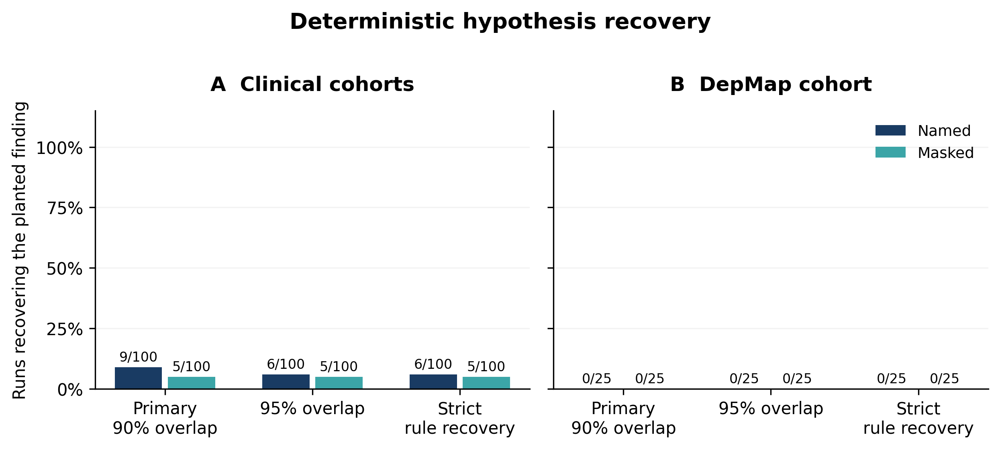

# Aim 1: completed structured Luna pilot

All 250 planned runs completed: 200 clinical and 50 DepMap, totaling 1,493 submitted iterations and 4,480 structured claims. Recovery was scored deterministically; LLM novelty and legacy matching were not used.

| Family | Condition | Primary | Strict |
|---|---|---:|---:|
| Clinical | Named | 9/100 | 6/100 |
| Clinical | Masked | 5/100 | 5/100 |
| DepMap | Named | 0/25 | 0/25 |
| DepMap | Masked | 0/25 | 0/25 |



- [Vector PDF](aim1_recovery.pdf), [editable SVG](aim1_recovery.svg), and [figure caption](figure_caption.md)
- [Full methods and results report](report.md)
- [Post hoc diagnostics explaining missed recovery requirements](diagnostics.md)
- [Per-run scores](run_scores.csv), [group scores](group_scores.csv), and [machine-readable summary](summary.json)
- [Discovery curves](discovery_curves.pdf)
- [Frozen protocol](protocol.json), [scoring implementation](implementation_for_scoring.json), [software versions](environment.json), and [verification](verification.json)
- [Technical validation notes](validation_notes.json) and [prespecified interruption sensitivity](supplemental_analysis_plan.json)

This is a new development pilot using Luna 5.6 and a structured, held-out evaluation protocol. It does not isolate the effect of replacing the archived LLM judge. No DepMap run submitted the full four-gate target definition; the earlier clinical-versus-DepMap reversal was not reproduced. Keep this figure's interpretation separate from the archived percentages.

The portable archive `aim1_structured_checkpoint.tar.gz` was delivered separately with all discovery/evaluation inputs, original submissions, analysis code and outputs, narratives, receipts, detailed deterministic claim scores, and excluded setup records. Its checksum is in [archive_reference.json](archive_reference.json). Expanded transcripts, detailed scores, and machine-specific run paths are intentionally omitted from Git. Restore the archive and regenerate all scores without an LLM:

```bash
.venv/bin/python experiments/aim1_recovery/archive.py restore \
  --archive /path/to/aim1_structured_checkpoint.tar.gz --out data/restored_aim1
.venv/bin/python experiments/aim1_recovery/score.py \
  --plan data/restored_aim1/experiment/plan.json \
  --out experiments/aim1_recovery/results/restored
```
