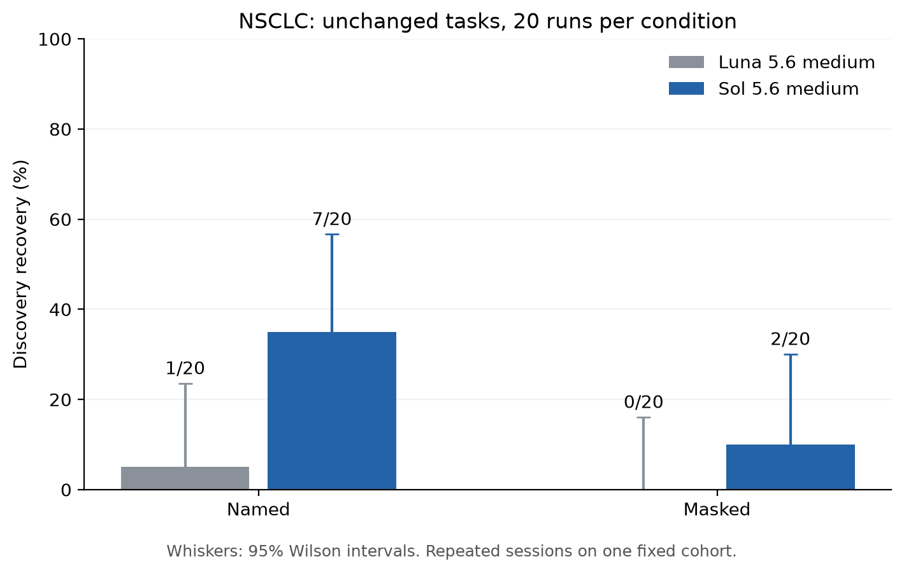

# Sol 5.6 medium: NSCLC discovery recovery

Completed all 40 planned formal sessions: 20 named and 20 masked, each with 25 validated iteration records (1,000 total). No terminal failures, replacement sessions, or technical resumes occurred. Two successful setup sessions are excluded.

| Model | Condition | Recovery | Rate | 95% Wilson interval | Strict | Confirmed |
|---|---|---:|---:|---:|---:|---:|
| Luna 5.6 medium | Named | 1/20 | 5% | 0.9%–23.6% | 1 | 1 |
| Luna 5.6 medium | Masked | 0/20 | 0% | 0.0%–16.1% | 0 | 0 |
| Sol 5.6 medium | Named | 7/20 | 35% | 18.1%–56.7% | 7 | 7 |
| Sol 5.6 medium | Masked | 2/20 | 10% | 2.8%–30.1% | 2 | 2 |



The Sol rates are higher than the archived Luna NSCLC rates in both conditions. The observed named rate exceeds the masked rate. These are small samples of fresh model sessions on one fixed synthetic cohort; they do not establish a general model ranking or biological discovery rate. The intervals describe session variability. No significance threshold or optional stopping decision was applied to these comparisons.

## What stayed fixed

The source is the archived synthetic NSCLC cohort in `example_data_clinical_all_claude/ds001/nsclc`: 50,000 patients, split into the same 40,000 discovery and 10,000 held-out rows with split seed 20260904. The outcome is progression-free survival in months. Naming conditions contain the same patient values; masked predictor names and categorical labels are opaque.

Dataset, instructions, description, and schema bytes match the prior v2 NSCLC tasks. Only model labels and job identifiers changed in public inputs. The 25-iteration budget, required screening/multivariable/refinement/robustness actions, dispatch prompt, hidden evaluator, and deterministic recovery rules were unchanged.

Primary recovery requires the complete planted subgroup, correct outcome, exposure and direction, and at least 90% subgroup precision and recall. Strict recovery requires equivalent boundaries. Held-out confirmation is secondary and requires finite linked discovery evidence plus a correctly signed held-out result under the existing per-distinct-claim allocation `alpha = 0.05/[j(j+1)]`. Both subgroup treatment effects and explicit interactions can qualify for primary recovery.

## Execution and validation

Every formal replicate was dispatched to a fresh `gpt-5.6-sol` agent with `reasoning_effort=medium` and `fork_turns=none`. The coordinator knew the earlier answer key; workers received only their own task workspace and no inherited context or recovery feedback. Dispatch acknowledgments and transcript model labels agree. Per-response tier, token, and compute telemetry are unavailable; priority service is advertised by the tool. Equal iteration counts do not establish equal compute or 25 independent model reasoning turns.

The launch plan called for scoring after the batch closed. At the user's request, 7 interim inspections of validated completed runs were made and logged. Inputs, scoring, sample size, dispatch order, and stopping rules were not changed. The same final 40 attempts were retained regardless of interim outcomes.

Input and evaluator hashes, transcript reconstruction, required actions, and retained script/output receipts were validated. Checkpoints were packed only while every worker was idle. See `verification.json` and `reproducibility.json` for final integrity and archive-restoration checks. The full archive retains inputs, private evaluator, both setup sessions, every research script/output/transcript, and interim reports. Its public checksum receipt is `archive_reference.json`.

## Reproduce

```bash
python experiments/aim1_recovery/archive.py restore \
  --archive aim1_sol_nsclc_20260905_checkpoint.tar.gz --out restored_sol
python experiments/aim1_recovery/score.py \
  --plan restored_sol/experiment/plan.json --out restored_sol/rescored
python experiments/aim1_recovery/report_nsclc_comparison.py \
  --root restored_sol/experiment \
  --baseline experiments/aim1_recovery/results/luna_20260905_priority_v2_restored/run_scores.csv \
  --out restored_sol/comparison
```

Use `run_scores.csv` for per-run outcomes, `group_scores.csv` for unchanged scorer aggregates, and `model_comparison.csv` for the NSCLC-only model comparison. Generic scorer output also contains empty DepMap aggregate rows; no DepMap sessions were run.
