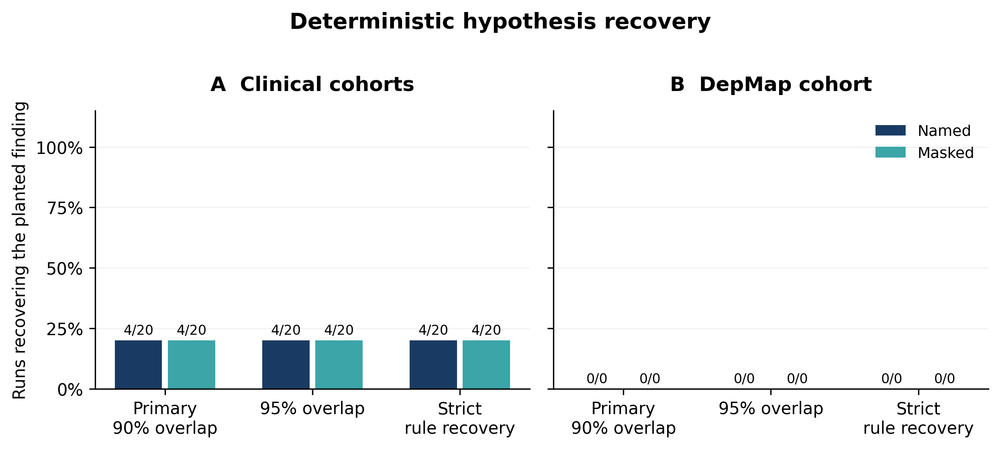

# Sol 5.6 medium via local Codex CLI: DS001 NSCLC recovery

Completed all 40 planned formal sessions: 20 named and 20 anonymized/masked,
each with 25 receipt-validated research records (1,000 total). The separate
one-per-condition setup gate also completed 25 records per session and is
excluded from every recovery result below.

| Runtime | Condition | Primary | Rate (95% Wilson CI) | Strict | Held-out confirmed | Interaction confirmed |
|---|---|---:|---:|---:|---:|---:|
| Sol 5.6 local CLI | Named | 4/20 | 20% (8.1%-41.6%) | 4/20 | 4/20 | 3/20 |
| Sol 5.6 local CLI | Masked | 4/20 | 20% (8.1%-41.6%) | 4/20 | 4/20 | 2/20 |
| Sol 5.6 Work (prior) | Named | 7/20 | 35% (18.1%-56.7%) | 7/20 | 7/20 | not compared here |
| Sol 5.6 Work (prior) | Masked | 2/20 | 10% (2.8%-30.1%) | 2/20 | 2/20 | not compared here |

The local CLI result is tied across naming conditions. Relative to the prior
Sol Work experiment, local CLI observed three fewer named recoveries and two
more masked recoveries. These are small, independent session samples with a
different runtime/configuration and unmatched token/compute budgets; the table
is descriptive, not a controlled runtime effect estimate.



## Fixed protocol

The experiment uses only DS001 NSCLC: the archived 50,000-row source cohort,
split with seed 20260904 into the same fixed 40,000 discovery rows and 10,000
held-out rows used by the v2 Sol Work experiment. Workers received only their
own public workspace and the structured 25-iteration protocol. Dataset,
masking, research actions, schema, scorer, precision/recall threshold, and
denominator were not changed. DS002 and DS003 were not prepared, run, copied,
or reported.

Primary recovery is complete structured identity under the v2 rule; strict
recovery requires equivalent boundaries. Held-out confirmation is reported
separately and does not gate identity. No optional novelty judge was used.

## Iteration endpoints

| Condition | Primary/strict iterations | Confirmed iterations | Interaction-confirmed iterations | Capped mean endpoint |
|---|---|---|---|---:|
| Named | 6, 8, 9, 10 | 6, 8, 9, 10 | 6, 10, 23 | 21.65 |
| Masked | 8, 9, 11, 14 | 8, 9, 11, 14 | 14, 18 | 22.10 |

All eight primary recoveries were already linked to discovery evidence and
held-out support at their first complete submission, so primary and confirmed
iterations coincide. Nonrecoveries are censored at iteration 25 in the capped
mean endpoint.

## Execution and interruption record

The exact live probe returned `READY` for `gpt-5.6-sol` with medium reasoning.
Formal execution used Codex CLI 0.153.4, ChatGPT authentication,
`workspace-write`, approvals disabled, closed stdin, four concurrent independent
scientists, and `/data1/ken/envs/gptoss3/bin/python` (Python 3.13.6) as the
user-selected analysis interpreter. The CLI account/config default service tier
was used; no priority or Work-tier equivalence is claimed.

A usage-limit event interrupted jobs 0027-0040. All 14 attempts and their CLI
threads were retained. Jobs 0027-0030 had 24, 8, 15, and 2 accepted iterations;
jobs 0031-0040 had created threads but no accepted records. After the user reset
usage, the launcher resumed every affected original thread with `--resume`.
All 14 then finalized; there were no replacement contexts or terminal failures.

Available successful-turn telemetry totals 175,147,967 input tokens
(170,640,128 cached), 1,292,625 output tokens, and 126,497 reasoning-output
tokens for the 40 formal sessions. Failed usage-limit turns did not emit final
usage records, so these totals are lower bounds on billed/processed usage.
The excluded setup sessions separately reported 8,986,420 input tokens
(8,666,112 cached), 89,238 output tokens, and 7,605 reasoning-output tokens.

## Validation and reproduction

All formal transcripts reconstruct successfully with exactly 25 iterations,
all four required actions, valid hashes/receipts, the frozen model/harness, and
40 unique thread IDs. The fixed scorer completed 40/40 attempts. Packing while
idle included the setup sibling; restoration into a new directory rescored all
40 attempts, and regenerated `run_scores.csv` and `group_scores.csv` were byte
identical to the originals.

The Git-ignored raw archive remains at
`data/ds001_sol_cli_complete.tar.gz` (16,047,534 bytes); its SHA-256 receipt is
in `archive_reference.json`. Raw CLI logs remain outside Git because they can
contain extensive context. Reproduce from the repository root with:

```bash
/data1/ken/envs/gptoss3/bin/python -m experiments.aim1_recovery.archive restore \
  --archive data/ds001_sol_cli_complete.tar.gz --out data/ds001_sol_cli_restored
/data1/ken/envs/gptoss3/bin/python -m experiments.aim1_recovery.score \
  --plan data/ds001_sol_cli_restored/experiment/plan.json \
  --out data/ds001_sol_cli_restored/rescored
```

Use `run_scores.csv` for per-session endpoints, `group_scores.csv` for scorer
aggregates, and the JSON records here for setup, interruption, environment, and
archive validation details.
