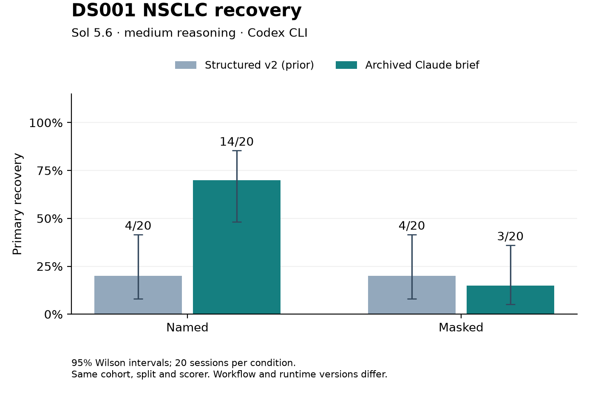

# Sol medium CLI with the archived Claude brief: DS001 NSCLC

Completed all 40 formal sessions: 20 named and 20 masked. The two separate setup sessions (11 masked iterations and nine named iterations) passed validation and are excluded from recovery estimates. All 42 research sessions used distinct CLI threads. All 40 formal sessions completed on their first launch, with no technical interruptions or terminal failures.

| Prompt | Condition | Primary | Rate (95% Wilson CI) | Strict | Held-out confirmed | Interaction confirmed |
|---|---|---:|---:|---:|---:|---:|
| Archived Claude brief | Named | 14/20 | 70% (48.1%–85.5%) | 14/20 | 14/20 | 7/20 |
| Archived Claude brief | Masked | 3/20 | 15% (5.2%–36.0%) | 3/20 | 3/20 | 1/20 |
| Structured v2 (prior) | Named | 4/20 | 20% (8.1%–41.6%) | 4/20 | 4/20 | 3/20 |
| Structured v2 (prior) | Masked | 4/20 | 20% (8.1%–41.6%) | 4/20 | 4/20 | 2/20 |

The loose-brief round recovered 14/20 named and 3/20 masked sessions, compared with 4/20 in each condition in the prior structured CLI round. This is a descriptive comparison of independent stochastic sessions on one fixed cohort; the prompt/workflow and runtime versions differ, and actual iterations and compute are not matched.



## What changed

The new `claude-legacy-loose-v1` option uses the condition-specific task brief archived with the Claude experiments, replacing only the public row count (50,000 → 40,000) and appending the current runtime and structured recording contract. The archived reference run records `claude-opus-4-7` and `claude-code-manual@1.0`. This reproduces the archived task brief, not the full Claude Code system context.

The mandatory 25 completed iterations, percentage-based exploration schedule, four-action quota, and distinct-script/sequential-output requirements were removed. The original up-to-25 ceiling and agent-selected early stopping were restored. The archived propose/test/update loop and explicit systematic treatment-effect heterogeneity search remain. Structured findings, ordered timestamped submissions, retained analysis code/results, and a final narrative remain required; these are differences from the archived Claude output process.

The default structured v2 mode remains available. The new transcript harness label is `codex-cli-claude-legacy-loose-v1`. See the [frozen protocol and exact prompts](../../protocols/sol_nsclc_cli_loose_20260906/README.md).

## Controls and interpretation

Only DS001 NSCLC was prepared and run. The archived 50,000-row source, split seed 20260904, 40,000 discovery rows, 10,000 held-out rows, masking, schema, scorer and scientific thresholds were retained. Discovery and held-out frames match the prior CLI run exactly in values and row order. Dataset descriptions and the transcript schema are byte-identical. Parquet serialization bytes differ with the newer writer; `data_comparison.json` records these checks.

Primary recovery requires complete, correctly directed structured identity with at least 90% subgroup precision and recall. Strict recovery requires equivalent boundaries. Held-out confirmation is a separate endpoint requiring finite linked discovery evidence and signed held-out support under the frozen online alpha spending rule. Interaction confirmation is reported separately. No novelty judge was used, and recovery was not inspected during setup or formal execution.

Runtime differed from the prior CLI round: 27 formal sessions launched with Codex CLI 0.153.0 and 13 with 0.153.4 (the prior round used 0.153.4). The cause of the installed version change is not established; the coordinator did not request an update. `runtime_audit.json` retains each launch version and confirms unchanged Sol medium flags. The preparation-time environment snapshot remains preserved. This round also used a new Python 3.13.7 environment versus the prior unavailable Python 3.13.6 environment. The exact `gpt-5.6-sol` medium access probe returned `READY`. Execution used ChatGPT authentication, workspace-write, approvals disabled, closed stdin and four concurrent sessions. The CLI account/config default service tier was used. Resolved package versions and probe evidence are in `environment.json`; transcript model labels are not independent backend attestation.

| Prompt | Condition | Actual iterations: median [min, max] | Total iterations |
|---|---|---:|---:|
| Archived Claude brief | Named | 9.5 [7, 25] | 211 |
| Archived Claude brief | Masked | 9.5 [7, 18] | 206 |
| Structured v2 (prior) | Named | 25 [25, 25] | 500 |
| Structured v2 (prior) | Masked | 25 [25, 25] | 500 |

The formal sessions retained 417 iteration records. Successful-turn telemetry totals 176,799,261 input tokens (172,541,312 cached), 1,163,196 output tokens, and 210,256 reasoning-output tokens. These totals exclude setup and the access probe. Failed turns, if any, may omit usage; full per-session telemetry is retained in `usage_telemetry.json`.

## Validation and archive

All 40 formal transcripts reconstruct from ordered, hash-checked iteration records and match their saved transcripts. Public input hashes, iteration ceilings, model/harness labels, summaries and distinct CLI threads were checked. The loose mode does not enforce script/output hashes or execution-time checks, so receipts do not certify contemporaneous execution or scientific originality. Iteration counts and iteration endpoints should not be treated as matched measures of compute.

The only implementation change after preparation was a report-prose correction so the generated report describes the loose stopping and integrity rules. Scientific scoring logic and thresholds were unchanged; preparation and scoring hashes are retained separately. The 27 focused tests passed (two localhost tests required socket access), lint passed, and the six report tests passed again after the prose correction. A scoring watcher encountered a filesystem access error while reading a live log and was restarted with log access. This did not interrupt or replace any research session; the original error is archived.

The idle archive is `data/ds001_sol_cli_loose_complete.tar.gz` (19,301,353 bytes). Restoration into a new directory and rescoring regenerated byte-identical `run_scores.csv` and `group_scores.csv`. The SHA-256 receipt is in `archive_reference.json`. Raw CLI logs, code, data and archives remain under Git-ignored `data/`; compact results and provenance are retained here.

Reproduce scoring from the repository root with:

```bash
data/sol_loose_env/bin/python -m experiments.aim1_recovery.archive restore \
  --archive data/ds001_sol_cli_loose_complete.tar.gz --out data/loose_restore_check
data/sol_loose_env/bin/python -m experiments.aim1_recovery.score \
  --plan data/loose_restore_check/experiment/plan.json --out data/loose_restore_check/rescored
```

Use `run_scores.csv` for individual sessions, `group_scores.csv` for the scorer aggregates, and `prompt_comparison.csv` for the prior/current comparison.
